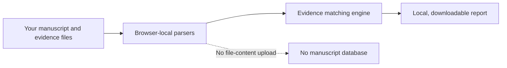

<p align="center">
  
</p>

<h1 align="center">EvidenceLock</h1>

<p align="center">
  <strong>Every number should have evidence.</strong><br />
  A local-first evidence-chain checker for research manuscripts.
</p>

<p align="center">
  <a href="./README.zh-CN.md">简体中文</a>
  ·
  <a href="#quick-start">Quick Start</a>
  ·
  <a href="#privacy-by-design">Privacy</a>
  ·
  <a href="#roadmap">Roadmap</a>
</p>

<p align="center">
  <a href="https://github.com/xhf23998-cmyk/EvidenceLock/actions/workflows/ci.yml">
    
  </a>
  = 22.13" />
  
  <a href="./LICENSE">
    
  </a>
</p>

---

## Why EvidenceLock?

Research results are repeated across abstracts, methods, tables, captions, supplementary files, and reviewer responses. A single stale value can survive several rounds of editing and reach submission unnoticed.

EvidenceLock reconnects numerical claims in a manuscript to their supporting files. It helps authors find:

- conflicting sample counts, accuracy, F1, AUC, P values, latency, and run counts;
- claims that have no traceable evidence file;
- inconsistent values across manuscript sections;
- ambiguous evidence that belongs to multiple datasets, models, or experiment runs.

Unlike a generic writing assistant, EvidenceLock does not rewrite the paper or invent an answer. It shows the manuscript statement, the candidate evidence row, the reason for the decision, and the next action for a human reviewer.

## What makes it useful?

| Capability | What it does |
| --- | --- |
| Traceable checks | Links each finding to a manuscript line and an evidence-file row |
| Conservative matching | Marks ambiguous multi-experiment results for review instead of forcing a conflict |
| Unit-aware comparison | Normalizes percentages, ratios, seconds/milliseconds, and common units |
| Rounding tolerance | Treats values such as `95.8%` and `0.9576` as compatible when precision explains the difference |
| Structured tables | Reads CSV and TSV headers, fields, values, and source line numbers |
| Local-first privacy | Parses manuscript files in the browser without uploading their contents |
| Actionable reports | Exports a Markdown checklist with priorities, evidence anchors, and suggested actions |

## A small example

| Location | Claim | Evidence | Result |
| --- | ---: | ---: | --- |
| Abstract | Accuracy = `96.2%` | `results.csv` = `95.8%` | Conflict |
| Results | Macro-F1 = `94.1%` | `results.csv` = `0.941` | Supported |
| Methods | Total samples = `120` | Train `80` + test `38` | Review required |

EvidenceLock turns these differences into a prioritized, inspectable report instead of a black-box score.

## Supported files

- Manuscripts: DOCX, PDF, TXT, Markdown
- Evidence: CSV, TSV, DOCX, PDF, TXT, Markdown
- Limits: 25 MB per file, up to 20 evidence files, 100 MB total evidence size

Scanned image-only PDFs currently require OCR before analysis.

## Privacy by design



The current application reads selected files with browser APIs and bundled parsers. It does not send manuscript contents to an analysis API, does not store reports in browser storage, and does not provision manuscript database or object-storage bindings.

As with any browser application, highly sensitive clinical, personal, defense, or commercial data should still be de-identified and processed on a controlled device.

## Quick Start

Requirements:

- Node.js `>=22.13.0`
- npm

```bash
git clone https://github.com/xhf23998-cmyk/EvidenceLock.git
cd EvidenceLock
npm ci
npm run dev
```

Open the local address printed by the development server.

To verify a change:

```bash
npm test
npm run lint
```

The test suite covers numerical normalization, rounding, unit conversion, structured CSV parsing, ambiguous evidence, dataset scopes, server rendering, and repository integrity.

## How it works

1. **Extract** numerical statements and their nearby semantic context.
2. **Normalize** units, percentages, ratios, and displayed precision.
3. **Index** structured and unstructured evidence files with source anchors.
4. **Match conservatively** by metric, scope, qualifier, value, and tolerance.
5. **Report** supported claims, confirmed conflicts, and unresolved evidence separately.

## Project status

EvidenceLock is an early public beta designed for pre-submission quality control. It is useful for finding review targets, but it does not determine whether a study is true, statistically valid, or publication-ready.

Human review remains mandatory.

## Roadmap

- [ ] OCR for scanned PDFs
- [ ] Dataset/model/run selectors for complex evidence tables
- [ ] User-adjustable numerical tolerances
- [ ] PDF, CSV, and JSON report exports
- [ ] Resolved / false-positive / accepted-risk workflow
- [ ] Version-to-version manuscript comparison
- [ ] Word, Overleaf, and reference-manager integrations

## Contributing

Bug reports, reproducible edge cases, anonymized test fixtures, and focused pull requests are welcome. Please avoid submitting unpublished or personally identifiable research data in public issues.

## License

Released under the [MIT License](./LICENSE).

---

<p align="center">
  <strong>Evidence before confidence.</strong><br />
  Built to make scientific handoff more traceable, reviewable, and calm.
</p>
