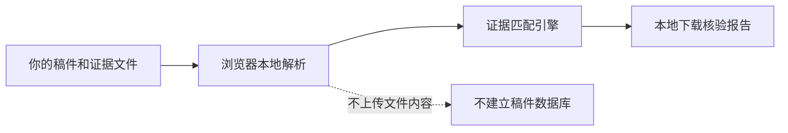

<p align="center">
  
</p>

<h1 align="center">EvidenceLock · 证据锁</h1>

<p align="center">
  <strong>让每个数字找到证据。</strong><br />
  面向科研稿件的本地优先证据链核验工具。
</p>

<p align="center">
  <a href="./README.md">English</a>
  ·
  <a href="#快速开始">快速开始</a>
  ·
  <a href="#隐私设计">隐私设计</a>
  ·
  <a href="#路线图">路线图</a>
</p>

---

## 为什么需要 EvidenceLock？

一项研究结果往往会同时出现在摘要、方法、正文、表格、图注、补充材料和审稿回复中。经过多轮修改后，一个已经过期的数字很容易被遗留到最终稿。

EvidenceLock 将稿件中的数值陈述重新连接到源数据和证据文件，帮助作者发现：

- 样本量、准确率、F1、AUC、P 值、延迟和实验次数冲突；
- 没有明确来源文件的数值；
- 摘要、方法和结果部分之间的不一致；
- 同时对应多个数据集、模型或实验批次的模糊证据。

它不是一个替你改写论文的通用写作助手，也不会为了给出答案而强行匹配。每一条发现都会展示稿件原文、候选证据、判断原因和建议动作，最终由研究者确认。

## 它有什么不同？

| 能力 | 作用 |
| --- | --- |
| 可追溯核验 | 每个问题都连接到稿件行号和证据文件来源行 |
| 保守判断 | 多实验结果无法安全区分时标记“待核实”，不制造伪冲突 |
| 单位归一化 | 识别百分比、比例、秒/毫秒和常见单位 |
| 舍入容差 | 能理解 `95.8%` 与 `0.9576` 可能只是显示精度不同 |
| 结构化表格 | 解析 CSV、TSV 的表头、字段、数值和来源行 |
| 本地优先隐私 | 在浏览器内解析文件，不上传稿件内容 |
| 可执行报告 | 导出带优先级、证据锚点和修改建议的 Markdown 清单 |

## 一个简单示例

| 位置 | 稿件陈述 | 证据 | 结果 |
| --- | ---: | ---: | --- |
| 摘要 | 准确率 `96.2%` | `results.csv` 为 `95.8%` | 数值冲突 |
| 结果 | 宏平均 F1 `94.1%` | `results.csv` 为 `0.941` | 已支持 |
| 方法 | 总样本 `120` | 训练 `80` + 测试 `38` | 需要复核 |

EvidenceLock 会把这些差异整理成可检查、可定位、按风险排序的报告，而不是只给出一个无法解释的黑箱分数。

## 支持的文件

- 稿件：DOCX、PDF、TXT、Markdown
- 证据：CSV、TSV、DOCX、PDF、TXT、Markdown
- 限制：单文件 25 MB，最多 20 个证据文件，证据总大小不超过 100 MB

纯图片扫描版 PDF 目前需要先完成 OCR。

## 隐私设计



当前应用使用浏览器文件接口和随应用打包的解析器读取文件，不会把稿件内容发送给分析 API，不会把报告写入浏览器存储，也没有配置用于保存稿件的数据库或对象存储。

但对于临床隐私、个人身份、国防和商业机密等高度敏感数据，仍建议先去除可识别信息，并在受控设备上使用。

## 快速开始

环境要求：

- Node.js `>=22.13.0`
- npm

```bash
git clone https://github.com/xhf23998-cmyk/EvidenceLock.git
cd EvidenceLock
npm ci
npm run dev
```

打开开发服务显示的本地地址即可使用。

提交代码前运行：

```bash
npm test
npm run lint
```

自动测试覆盖数值归一化、舍入、单位换算、结构化 CSV、多候选证据、训练/测试范围、服务端渲染和仓库完整性。

## 工作原理

1. **提取**稿件中的数值和附近语义。
2. **归一化**单位、百分比、比例和显示精度。
3. **索引**结构化及非结构化证据，并保留来源位置。
4. **保守匹配**指标、范围、模型限定词、数值和舍入容差。
5. **分别报告**已支持、确定冲突和暂时无法确认的证据。

## 项目状态

EvidenceLock 当前处于早期公开测试阶段，定位是科研交付前的质量检查工具。它可以发现值得人工关注的位置，但不能判断研究是否真实、统计方法是否正确，也不能代替作者、统计专家、编辑或审稿人。

所有结果都需要人工复核。

## 路线图

- [ ] 扫描版 PDF OCR
- [ ] 复杂表格的数据集、模型和实验批次选择器
- [ ] 用户自定义数值容差
- [ ] PDF、CSV 和 JSON 报告导出
- [ ] 已解决、误报和接受风险工作流
- [ ] 不同稿件版本对比
- [ ] Word、Overleaf 和文献管理工具集成

## 参与贡献

欢迎提交 Bug、可复现边界案例、匿名化测试文件和范围明确的 Pull Request。请勿在公开 Issue 中上传未发表论文、患者信息或其他可识别的科研数据。

## 开源许可

项目采用 [MIT License](./LICENSE)。

---

<p align="center">
  <strong>Evidence before confidence.</strong><br />
  让科研交付更可追溯、更易复核，也更从容。
</p>
